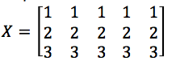
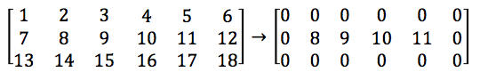

# Computing Applications for Engineers
## PALS 3

### Question 1
Develop a Matlab script that is able to
 
a.	display the age of a person when he/she enters his/her birth year.

b.	continuously asks the user to enter a year until the user enters a zero value.

Given the following command
`Umur = CountAge(year)`
develop a Matlab function that when the above command was made, the variable Umur will obtain the age value calculated by the function CountAge

### Question 2
Develop a Matlab function that have 1 input argument, length of the cube, and 2 output arguments, surface area and volume of the cube.

### Question 3
Develop a Matlab script that uses ‘for’ loops to create the following matrix X

### Question 4
Develop a Matlab script that changes the (first & last) (row & column) of any size matrix into all zeros. For example:

