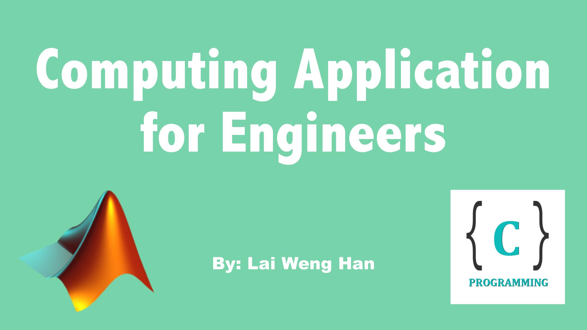
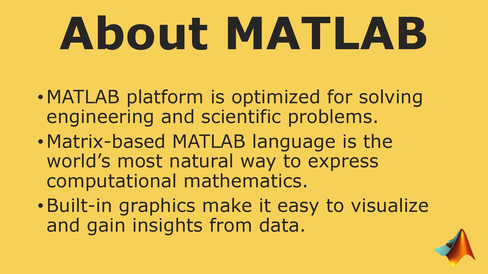

# Computing Applications for Engineers

by: [Lai Weng Han](http://github.com/superoo7)

## Introduction

## PALS Questions ans Answers
* [PALS1](/PALS1)
* [PALS2](/PALS2)
* [PALS3](/PALS3)

## To download

[Link](https://github.com/superoo7/PALS/archive/master.zip)
