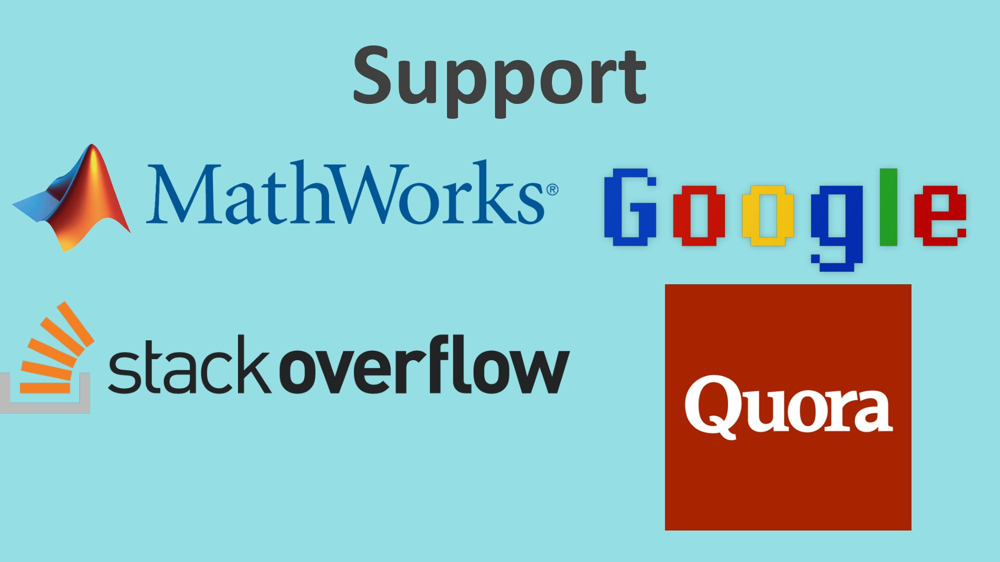

# Computing Applications for Engineers

by: [Lai Weng Han](http://github.com/superoo7)

## PALS Questions ans Answers
* [PALS1](/PALS1)
* [PALS2](/PALS2)
* [PALS3](/PALS3)
* [PALS4](/PALS4)
* [PALS5](/PALS5)
* [PALS6](/PALS6)

## Introduction

## To download
**Method 1: Download**

[Link](https://github.com/superoo7/PALS/archive/master.zip)

**Method 2: Git Clone**
`mkdir` and `cd` into appropriate folder

Then, clone this repo

`git clone https://github.com/superoo7/PALS.git`

## Some advanced stuff
### MATLAB
To increase performance, can simply run MATLAB in Terminal with 
__On Unix (MACOS)__
using bash, in `.bash_profile` add:

 `export PATH=/Applications/MATLAB_R2016b.app/bin:$PATH`

then can start matlab with no gui: `matlab -nodesktop`

run a certain script: `matlab -nojvm < scriptname.m`

### C
**Note: GCC is for C programming**

[Install GCC in Atom text editor](https://atom.io/packages/gpp-compiler)

In case you don't like using IDE for learning, I use GCC for doing this.

(PS: on MAC is just easy because once u installed Xcode, is installed together)

1) Create a C program (I use vim text editor)

`vim main.c`

2) After the code is done,

`gcc main.c -o main`

this basically did was making main.c into main that can be executed in with `./main`

The another short cut is using bash `&&`

`gcc main.c -o main && ./main` 

3) Run the program with `./main`
